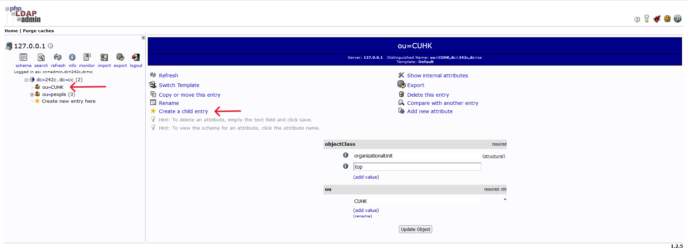
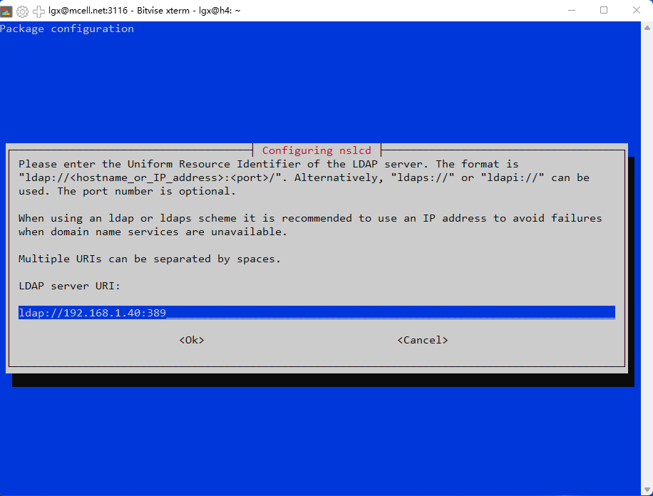
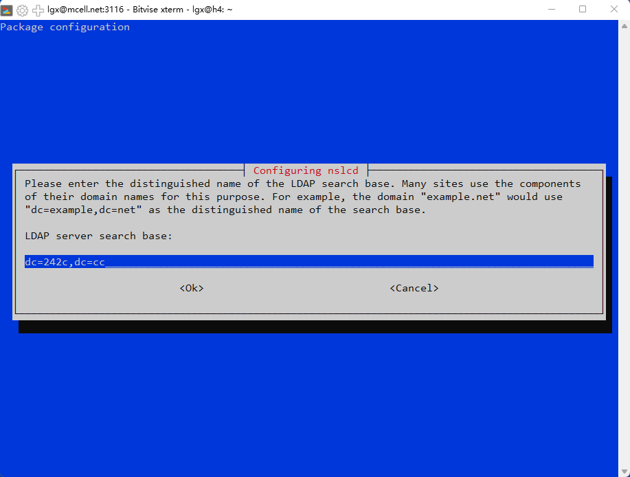
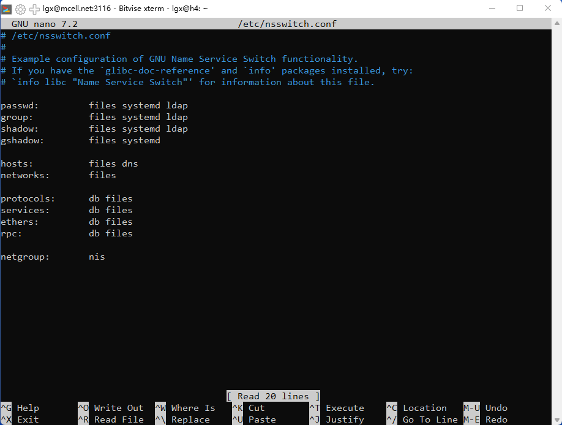
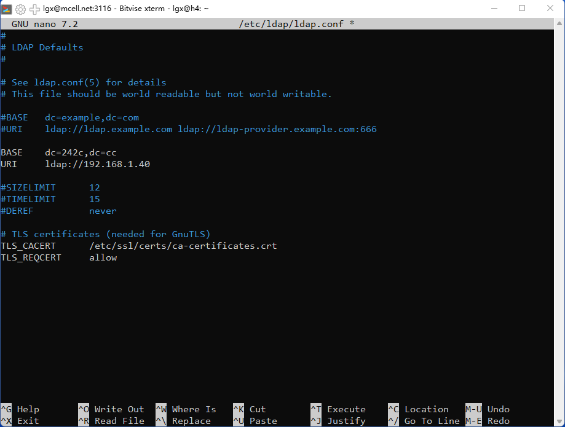

# Install and Configure OpenLDAP server over TLS and Client via Docker on Debian 12

**Contributors** (Equally contribution)

- Xing Zhao

- Gexin Liu

# Obtaining TLS certificates

    TLS certificate is required to run OpenLDAP over TLS, There are several ways to obtain TLS certificates recommended as follows:

1. Automatic certificate issuer such as [ACME.SH](https://github.com/acmesh-official/acme.sh) (recommended)

2. Third-party certificate issuer such as AWS

3. Self-signing certificate
   
   **The common name of the certificate used in this example is `ldap.242c.cc`, the hostname of the docker has to be the same as the certificate.**
   
   By default, three files will be generated with similar names such as: `server.crt`, `server.key`, `ca-certificates.crt` though the filename extension `crt `may become `pem` in some situations but are usually the same. 

# Server install via docker

Pull the openldap and phpldapadmin mirrors to the local

```
sudo docker pull bitnami/openldap
sudo docker pull osixia/phpldapadmin
```

Create a docker network called "ldapnet". This step is a preparation for connecting openldap and phpldapadmin to the same network so that phpldapadmin may connect to ldap more easily.

```
docker network create ldapnet
```

## Server config

### Option1: Run openldap via 'docker run' command

View this first to get a better understanding of the config parameters

```bash
sudo docker run --detach --name openldap \
  --network ldapnet\
  -p 389:1389 \
  -p 636:1636 \
  --restart always \
  --volume: /zx:/bitnami/openldap
  --env LDAP_ROOT="dc=242c,dc=cc" \
  --env LDAP_ADMIN_USERNAME=admin \
  --env LDAP_ADMIN_PASSWORD=adminpassword \
  --env LDAP_CONFIG_ADMIN_ENABLED=yes \
  --env LDAP_ENABLE_TLS=yes \
  --env LDAP_TLS_CERT_FILE=/bitnami/openldap/sasl2/server.crt \
  --env LDAP_TLS_KEY_FILE=/bitnami/openldap/sasl2/server.key \
  --env LDAP_TLS_CA_FILE=/bitnami/openldap/sasl2/ca-certificates.crt \
  --env LDAP_TLS_VERIFY_CLIENTS=allow \
  bitnami/openldap:latest
```

**Note**: 

- The argument '-p 389:1389' means map the TCP port 389 of host to the port 1389 of openldap container.  

- The argument "--restart always" means this docker container would try to restart if it stops. 

- `--volume: /examplepath:/bitnami/openldap` mounts the `/examplepath` path on the host to the path `/bitnami/openldap` in the container

- `LDAP_TLS_CERT_FILE`, `LDAP_TLS_KEY_FILE`, `LDAP_TLS_CA_FILE` point to the TLS certificates generate earlier, the file path must be the full path inside docker container

### Verify if the network is connected successfully

```
docker network inspect ldapnet
```

If the network is connected successfully, you will see the network status like shown below. Specifically, you can see the `"Name": "openldap"` above the `EndpointID:XXXX.`

```
[
    {
        "Name": "ldapnet",
        "Id": "0643a22111f49e3058a3b9a0feb6dd102098e89cea29189a49c9d6a57c2d2ee8",
        "Created": "2023-06-08T17:24:24.841083284+08:00",
        "Scope": "local",
        "Driver": "bridge",
        "EnableIPv6": false,
        "IPAM": {
            "Driver": "default",
            "Options": {},
            "Config": [
                {
                    "Subnet": "172.18.0.0/16",
                    "Gateway": "172.18.0.1"
                }
            ]
        },
        "Internal": false,
        "Attachable": false,
        "Ingress": false,
        "ConfigFrom": {
            "Network": ""
        },
        "ConfigOnly": false,
        "Containers": {
            "323343368cc3a9f8cf4f76f7bee000afc30b954290197c224142604b2cf4eff7": {
                "Name": "openldap",
                "EndpointID": "4955e070d6f8550264fa4b5b4495d25a6cde6e6208ddcb748eaa520247559e27",
                "MacAddress": "02:42:ac:12:00:02",
                "IPv4Address": "172.18.0.2/16",
                "IPv6Address": ""
            }
        },
        "Options": {},
        "Labels": {}
    }
] 
```

### Option2: Create a stack by using a compose file (docker swarm required)

**first create a yaml file**

```
sudo nano openldap.yml
```

Here we give an example. You can edit the compose file as showing below.

**Notice**: In the compose file, you can't use the 'Tab' key.

```yaml

services:
  openldap:
    image: bitnami/openldap:latest
    environment:
      - LDAP_ADMIN_USERNAME=admin
      - LDAP_ADMIN_PASSWORD=adminpassword
      - LDAP_CONFIG_ADMIN_ENABLED=yes
      - LDAP_CONFIG_ADMIN_USERNAME=admin
      - LDAP_CONFIG_ADMIN_PASSWORD=adminpassword
      - LDAP_ROOT=dc=242c,dc=cc 
      - LDAP_USER_DC=people
      - LDAP_ENABLE_TLS=yes
      - LDAP_TLS_CERT_FILE=/bitnami/openldap/sasl2/server.crt
      - LDAP_TLS_KEY_FILE=/bitnami/openldap/sasl2/server.key
      - LDAP_TLS_CA_FILE=/bitnami/openldap/sasl2/ca-certificates.crt
      - LDAP_TLS_VERIFY_CLIENTS=allow
      - LDAP_LOGLEVEL=1
    ports:
      - 389:1389
      - 636:1636
    hostname: "ldap.242c.cc"
    volumes:
      - /zx:/bitnami/openldap
    deploy:
      replicas: 1
      restart_policy:
        condition: on-failure
        delay: 5s
        max_attempts: 3
        window: 10s
```

    To achieve the high availability using docker swarm, it is recommended to mount the `/examplepath` on every worker nodes using services such as NFS, gluster, S3. We have tested mounting the path using NFS. By design, the swarm should maintain one ldap server running on a node and automatically create new container if the existing worker becomes unavailable. **Do remember to remove the mounted folder if anything related to LDAP such as is changed**

### Deploy the stack using compose file

```
sudo docker stack deploy --compose-file openldap.yml openldap
```

### Check if the service run successfully

```
sudo docker stack services openldap
```

**Note**: [What is the difference between docker service and stack?](https://stackoverflow.com/questions/44329083/what-is-the-difference-between-docker-service-and-stack)

    The `docker service` is used when managing individual 
service on a docker swarm cluster. It is the client command line to 
access the docker swarm manager.

    The `docker stack` can be used to manage a multi-service application. It also moves many of the options you would enter on the `docker service` into the `.yml file` (such as docker-cloud.yml or docker-compose.yml) for easier reuse. It 
works as a front end "script" on top of the docker swarm manager used 
by docker swarm cluster, so you can do everything `docker stack` does with `docker service`.

    Last but not least, you can consider the `docker service` vs `docker stack` is the same as `docker run` vs `docker compose`, but in the docker swarm cluster.

If the service run successfully, you will see the information as showing below. (contain one service)

```
ID             NAME                MODE         REPLICAS   IMAGE                     PORTS
we4qxs43l32s   openldap_openldap   replicated   1/1        bitnami/openldap:latest   *:389->1389/tcp, *:636->1636/tcp
```

### Check which node the service is running on

```
sudo docker service ps openldap_openldap
```

**Then you will see the information as showing below.**

```
ID             NAME                  IMAGE                     NODE      DESIRED STATE   CURRENT STATE           ERROR     PORTS
a7mwle2ldn4j   openldap_openldap.1   bitnami/openldap:latest   h2        Running         Running 3 minutes ago
```

And if you want to remove the service, run this code.

```
sudo docker stack rm openldap
```

### Run phpLDAPadmin (Here give an example)

```
sudo docker run \
--name phpldapadmin \
-p 10080:80 \
-p 10443:443 \
--network ldapnet \
--restart always \
--hostname phpldapadmin-service \
--env PHPLDAPADMIN_LDAP_HOSTS=openldap \
--detach osixia/phpldapadmin:latest
```

**Note**: We suggest to map 80 port to other port. (Here we map the port 80 to port 10080 and map the port 443 to port 10443, you also can map them to other ports.)

### Verify if the container is running

```
sudo docker ps
```

If the containers run successfully, you will see the container status as shown below.

```
CONTAINER ID   IMAGE                        COMMAND                  CREATED        STATUS        PORTS                                                                                      NAMES
323343368cc3   bitnami/openldap:latest      "/opt/bitnami/script…"   14 hours ago   Up 14 hours   0.0.0.0:636->636/tcp, :::636->636/tcp, 1636/tcp, 0.0.0.0:389->1389/tcp, :::389->1389/tcp   openldap
86f0cdb955de   osixia/phpldapadmin:latest   "/container/tool/run"    17 hours ago   Up 17 hours                                                                                              phpldapadmin
```

### Access the phpldapadmin via WEB UI

Using the URL https://IP_Address:10443 on the browser of host machine to access phpldapadmin. (Here, our URL is https://192.168.1.40:10443) 192.168.1.40 is the IP of the docker host

Log in with login DN and password. For this case, the credentials will be:

```
Login DN: cn=admin,dc=242c,dc=cc
Password: adminpassword
```


If you log in successfully, you will see the prompt "Authenticate to server Successfully logged into server" without any error.


Then you can create a new organization unit by clicking on the "dc=242c,dc=cc" -> Create a child Entry -> "Generic: Organizational Unit". (Here we use 'CUHK' as an example)


To create a new group, click on the Organization (CUHK) -> Create a child Entry -> "Generic: Posix Group". (Here we use 'sunlab' as an example)




Similarly, you can create a new user by clicking on the Group (sunlab) -> Create a child Entry -> "Generic: User Account". (Here we use 'zx' as an example)


 More options can be explored on the OpenLDAP by yourself.

## Test 1 | Check the ldap server

You can check if you successfully performed the above steps by trying to connect to the ldap server by the following methods: 

1 Test the connection without 'TLS'.

```
ldapsearch -x -H ldap://192.168.1.40 -b "dc=242c,dc=cc" -D "cn=admin,dc=242c,dc=cc" -w adminpassword
```

Then if you see these infomations, that menans the connection has been successfully established.

```
# extended LDIF
#
# LDAPv3
# base <dc=242c,dc=cc> with scope subtree
# filter: (objectclass=*)
# requesting: ALL
#

# 242c.cc
dn: dc=242c,dc=cc
objectClass: dcObject
objectClass: organization
dc: 242c
o: example

# people, 242c.cc
dn: ou=people,dc=242c,dc=cc
objectClass: organizationalUnit
ou: users
ou: people

# user01, people, 242c.cc
dn: cn=user01,ou=people,dc=242c,dc=cc
cn: User1
cn: user01
sn: Bar1
objectClass: inetOrgPerson
objectClass: posixAccount
objectClass: shadowAccount
userPassword:: Yml0bmFtaTE=
uid: user01
uidNumber: 1000
gidNumber: 1000
homeDirectory: /home/user01

# user02, people, 242c.cc
dn: cn=user02,ou=people,dc=242c,dc=cc
cn: User2
cn: user02
sn: Bar2
objectClass: inetOrgPerson
objectClass: posixAccount
objectClass: shadowAccount
userPassword:: Yml0bmFtaTI=
uid: user02
uidNumber: 1001
gidNumber: 1001
homeDirectory: /home/user02

# readers, people, 242c.cc
dn: cn=readers,ou=people,dc=242c,dc=cc
cn: readers
objectClass: groupOfNames
member: cn=user01,ou=people,dc=242c,dc=cc
member: cn=user02,ou=people,dc=242c,dc=cc

# search result
search: 2
result: 0 Success

# numResponses: 6
# numEntries: 5
```

2 Test the connection with 'TLS'. You just need to add the argument '-ZZ'.

```
ldapsearch -x -H -ZZ ldap://192.168.1.40 -b "dc=242c,dc=cc" -D "cn=admin,dc=242c,dc=cc" -w adminpassword
```

Similarly, if you see these information, that means the connection has successfully established with 'TLS'.

```
# extended LDIF
#
# LDAPv3
# base <dc=242c,dc=cc> with scope subtree
# filter: (objectclass=*)
# requesting: ALL
#

# 242c.cc
dn: dc=242c,dc=cc
objectClass: dcObject
objectClass: organization
dc: 242c
o: example

# people, 242c.cc
dn: ou=people,dc=242c,dc=cc
objectClass: organizationalUnit
ou: users
ou: people

# user01, people, 242c.cc
dn: cn=user01,ou=people,dc=242c,dc=cc
cn: User1
cn: user01
sn: Bar1
objectClass: inetOrgPerson
objectClass: posixAccount
objectClass: shadowAccount
userPassword:: Yml0bmFtaTE=
uid: user01
uidNumber: 1000
gidNumber: 1000
homeDirectory: /home/user01

# user02, people, 242c.cc
dn: cn=user02,ou=people,dc=242c,dc=cc
cn: User2
cn: user02
sn: Bar2
objectClass: inetOrgPerson
objectClass: posixAccount
objectClass: shadowAccount
userPassword:: Yml0bmFtaTI=
uid: user02
uidNumber: 1001
gidNumber: 1001
homeDirectory: /home/user02

# readers, people, 242c.cc
dn: cn=readers,ou=people,dc=242c,dc=cc
cn: readers
objectClass: groupOfNames
member: cn=user01,ou=people,dc=242c,dc=cc
member: cn=user02,ou=people,dc=242c,dc=cc

# search result
search: 3
result: 0 Success

# numResponses: 6
# numEntries: 5
```

**Note**: What's the different between LDAP over TLS (STARTTLS) and LDAP over SSL (LDAPS)? 
Ref: https://kb.sos-berlin.com/pages/viewpage.action?pageId=18778435

**LDAP over TLS (STARTTLS)** StartTLS in an extension to the LDAP protocol which uses the TLS protocol to encrypt communication. It works by establishing a normal - i.e. unsecured - connection with the LDAP server before a handshake negotiation between the server and the web services is carried out. Here, the server sends its certificate to prove its identity before the secure connection is established. If negotiation for a secure connection is unsuccessful then a standard LDAP connection may be opened. Whether or not this occurs depends on the LDAP server and its configuration.

**LDAP over SSL (LDAPS)** LDAPS is the non-standardized "LDAP over SSL" protocol that in contrast with StartTLS only allows communication over a secure port such as 636. It establishes the secure connection before there is any communication with the LDAP server. However, as LDAPS is not part of the LDAP standard, there is no guarantee that LDAPS client libraries actually verify the host name against the name provided with the security certificate.

## Client installation and configuration on other server

```
sudo apt -y install libnss-ldapd libpam-ldapd ldap-utils
```

**As soon as this command starts its execution, you will be able to see an interactive prompt, in which you can perform the various LDAP configurations explained in the following steps:**

1. Configure URI for LDAP Server. (The format is ldap://"hostname or IP":"port", here we use the ldap://192.168.1.40:389 as an example)
   
   

2. Set up Distinct Name for LDAP Search Base. (Here we use "dc=242c,dc=cc" as example)
   
   

3. This step will automatically generate and modify the "/etc/nsswitch.conf" file. Select the 'passwd', 'group', and 'shadow' and press 'ok'. 
   
   

4. Allow Automatic Creation of User's Home Directory
   
   ```
   sudo nano /etc/pam.d/common-session
   ```
   
   When this file opens with the nano editor, enter the following line of code at the end of this file.
   
   ```
   # add to the end if need (create home directory automatically at initial login)
   session required pam_mkhomedir.so skel=/etc/skel umask=077
   ```

5. Modify the NSSwitch configuration '/etc/nsswitch.conf' to use the ldap as a datasource if it does not configure automatically.
   
   Open the "/etc/nsswitch.conf" file, first.
   
   ```
   sudo nano /etc/nsswitch.conf
   ```
   
   Now change detail lines exact as below. Specifically, add the ```ldap``` to the end. (Here we give an example)
   
   

6. "/etc/ldap/ldap.conf" is the configuration file for all OpenLDAP clients. Open this file.
   
   ```
   sudo nano /etc/ldap/ldap.conf
   ```
   
   We need to specify two parameters: the **base DN** and the **URI** of our OpenLDAP server. Copy and paste the following text at the end of the file. Replace `your-domain` and `com` as appropriate. You can add multiple URIs later if the need arises.
   
   ```
   BASE    dc=242c,dc=cc
   URI    ldap://192.168.1.40
   ```
   
   Then add the "TLS_REQCERT allow" to the end. 
   
   ```
   TLS_REQCERT    allow
   ```
   
   

7. Configure the '/etc/nslcd.conf' file. Open the '/etc/nslcd.conf' file first.  
   
   ```
   sudo nano /etc/nslcd.conf
   ```
   
   Similarly with the '/etc/ldap/ldap.conf' file, add or change the 'base' and 'uri' information. 
   
   ```
   uri ldap://192.168.1.40:389
   base dc=242c,dc=cc
   ```
   
   And add the 'ssl start_tls' and 'tls_reqcert allow' to the end.
   
   ```
   ssl start_tls
   tls_reqcert allow
   ```
   
   

8. Restart Name Service Cache Daemon (nscd && nslcd)
   
   ```
   sudo systemctl restart nscd nslcd
   ```

9. Enable Name Service Cache Daemon (nscd && nslcd)
   
   ```
   sudo systemctl enable nscd nslcd
   ```

10. Update PAM Configuration. This command will display a dialogue box on your screen from which you can select any desired profiles that you want to be enabled. It is recommended to go with the default profile. Then, to continue, press the Enter key.If need, you can add the option "Create home directory on login".
    
    ```
    sudo pam-auth-update
    ```
    
     

## Test 2 | Check the ldap client

After you successfully perform the above steps, you can use the following command to try to log in to the user you created to confirm whether the ldap client is successfully installed and configured (if username is 'zx'):  

```
su zx
```

## Reconfigure ldap client

If you need to reconfigure the ldap client file, you can use the following command:

```
sudo dpkg-reconfigure nscd nslcd
```

## Remove ldap client config file

If you want to remove LDAP Client, you can use the following commands:    

```
sudo apt-get purge libnss-ldapd libpam-ldapd ldap-utils
sudo apt-get autoremove
```

# Reference

https://computingforgeeks.com/run-openldap-server-in-docker-containers/ https://linuxhint.com/configure-ldap-client-debian/

https://www.linuxbabe.com/debian/set-up-openldap-server-debian

https://www.server-world.info/en/note?os=Debian_11&p=openldap&f=3

https://0xzx.com/zh-tw/2022032518502186723.html

https://blog.csdn.net/Jackwolfskin888/article/details/82968761

https://www.cnblogs.com/eagle6688/p/16977245.html
